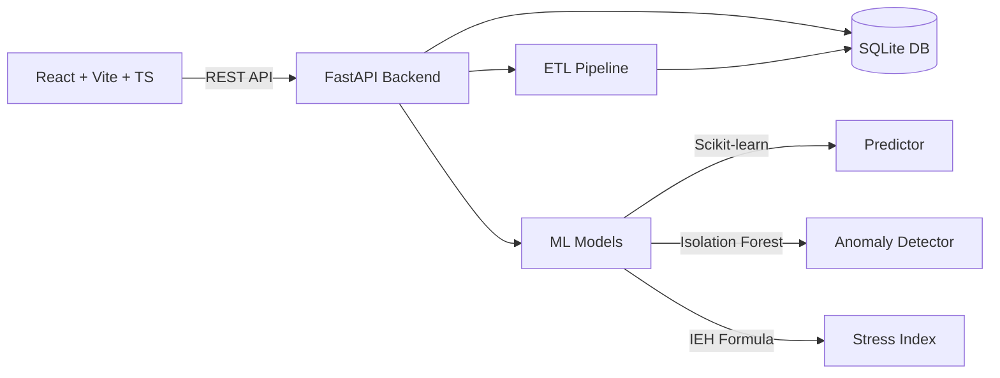

# 💧 Hydrofulness

> **Inteligencia Predictiva para la Gestión del Estrés Hídrico en Alicante**

[](https://python.org)
[](https://fastapi.tiangolo.com)
[](https://reactjs.org)
[](https://typescriptlang.org)
[](LICENSE)

**Hackathon AMAEM 2026** — Aguas Municipalizadas de Alicante

---

## ¿Qué es Hydrofulness?

Hydrofulness es un sistema de inteligencia hídrica que analiza patrones de consumo de agua por barrio en Alicante, detecta anomalías mediante Machine Learning, y predice escenarios futuros de estrés hídrico para facilitar la toma de decisiones sostenibles.

## Arquitectura



## Quick Start

```bash
# 1. Clonar el repositorio
git clone https://github.com/tu-equipo/DATATHON-AGUASDEALICANTE-HYDROFULNESS.git
cd DATATHON-AGUASDEALICANTE-HYDROFULNESS

# 2. Con Docker (un solo comando)
docker-compose up --build

# 3. Sin Docker (desarrollo)
# Backend
cd backend && python -m venv .venv
.venv\Scripts\activate        # Windows
source .venv/bin/activate     # Linux/Mac
pip install -r requirements.txt
uvicorn app.main:app --reload --port 8000

# Frontend (otro terminal)
cd frontend && npm install && npm run dev

# 4. Ejecutar ETL (cargar datos)
curl -X POST http://localhost:8000/api/v1/etl/run
```

**Abrir:** http://localhost:5173 (Dashboard) | http://localhost:8000/docs (Swagger)

## Despliegue en la Nube

### Opción 1: Vercel (Recomendado para Frontend rápido)
1. Haz un Fork de este repositorio en GitHub.
2. Ve a [vercel.com](https://vercel.com) y crea un nuevo proyecto importando el repositorio.
3. Ajustes de importación:
   - **Root Directory:** `frontend`
   - **Framework Preset:** Vite
   - **Build Command:** `npm run build`
   - **Output Directory:** `dist`
4. Dale a desplegar. El proyecto utilizará los datos *mock* automáticamente porque no encontrará el backend. Tu enlace será algo como `https://datathon-aguasdealicante-hydrofulness.vercel.app`.

### Opción 2: GitHub Pages
El proyecto ya cuenta con el Action en `.github/workflows/deploy.yml`. 
1. Sube tu código a la rama origin `main`.
2. Ve a los **Settings** del repositorio en GitHub -> **Pages**.
3. Bajo *Build and deployment*, cambia la fuente a **GitHub Actions**.
4. ¡Listo! La Action se ejecutará y publicará el frontend en tu página de GitHub.

## Estructura del Proyecto

```
├── frontend/                  # React + Vite + TypeScript
│   ├── src/
│   │   ├── components/        # Componentes reutilizables
│   │   │   ├── common/        # Layout, Sidebar, Header
│   │   │   ├── dashboard/     # KPIs, Charts, TopBarrios
│   │   │   └── charts/        # StressGauge, PredictionChart
│   │   ├── pages/             # Dashboard, Mapa, Predicciones...
│   │   ├── hooks/             # useDashboardData
│   │   ├── services/          # api.ts, mockData.ts
│   │   └── utils/             # alicante-barrios.ts
│   └── index.html
├── backend/                   # Python FastAPI
│   ├── app/
│   │   ├── api/v1/            # Endpoints REST
│   │   ├── services/
│   │   │   ├── etl/           # Loader, Cleaner, Transformer
│   │   │   └── ml/            # Predictor, AnomalyDetector, StressIndex
│   │   ├── models/            # Pydantic schemas
│   │   └── core/              # Config
│   └── requirements.txt
├── data/                      # CSV datos AMAEM (no subir a Git)
├── docker-compose.yml
└── README.md
```

## API Endpoints

| Método | Ruta | Descripción |
|--------|------|-------------|
| `POST` | `/api/v1/etl/run` | Ejecutar pipeline ETL |
| `GET`  | `/api/v1/etl/status` | Estado última ejecución |
| `GET`  | `/api/v1/consumos` | Consumos paginados con filtros |
| `GET`  | `/api/v1/consumos/resumen` | KPIs globales |
| `GET`  | `/api/v1/consumos/por-zona` | Consumo por barrio |
| `GET`  | `/api/v1/consumos/por-tipologia` | Distribución por uso |
| `GET`  | `/api/v1/consumos/serie-temporal` | Serie mensual |
| `GET`  | `/api/v1/anomalias` | Anomalías con filtros |
| `GET`  | `/api/v1/anomalias/resumen` | Resumen anomalías |
| `GET`  | `/api/v1/estres-hidrico` | Estrés por zona |
| `GET`  | `/api/v1/predicciones/consumo` | Predicción de consumo |
| `GET`  | `/api/v1/predicciones/anomalias` | Anomalías ML |
| `GET`  | `/api/v1/predicciones/estres` | IEH por barrio |
| `GET`  | `/api/v1/predicciones/estres/ranking` | Ranking estrés |

## Design System

| Token | Color | Uso |
|-------|-------|-----|
| `primary` | `#0EA5E9` | Elementos principales, agua |
| `secondary` | `#10B981` | Éxito, sostenibilidad |
| `accent` | `#F59E0B` | Alertas, atención |
| `danger` | `#EF4444` | Estrés crítico |
| `bg-dark` | `#0F172A` | Fondo principal |
| `bg-surface` | `#1E293B` | Superficies elevadas |

## Stack Tecnológico

- **Frontend:** React 18 · TypeScript · Vite · Tailwind CSS v4 · Recharts · Leaflet
- **Backend:** Python 3.11 · FastAPI · Pandas · Scikit-learn · SQLAlchemy · SQLite
- **Infra:** Docker Compose · GitHub

## Equipo

**Hydrofulness** — Hackathon de Datos AMAEM 2026

## Licencia

MIT — Proyecto open source para la gestión sostenible del agua.
